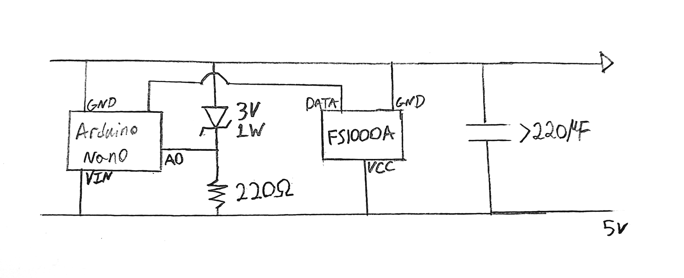
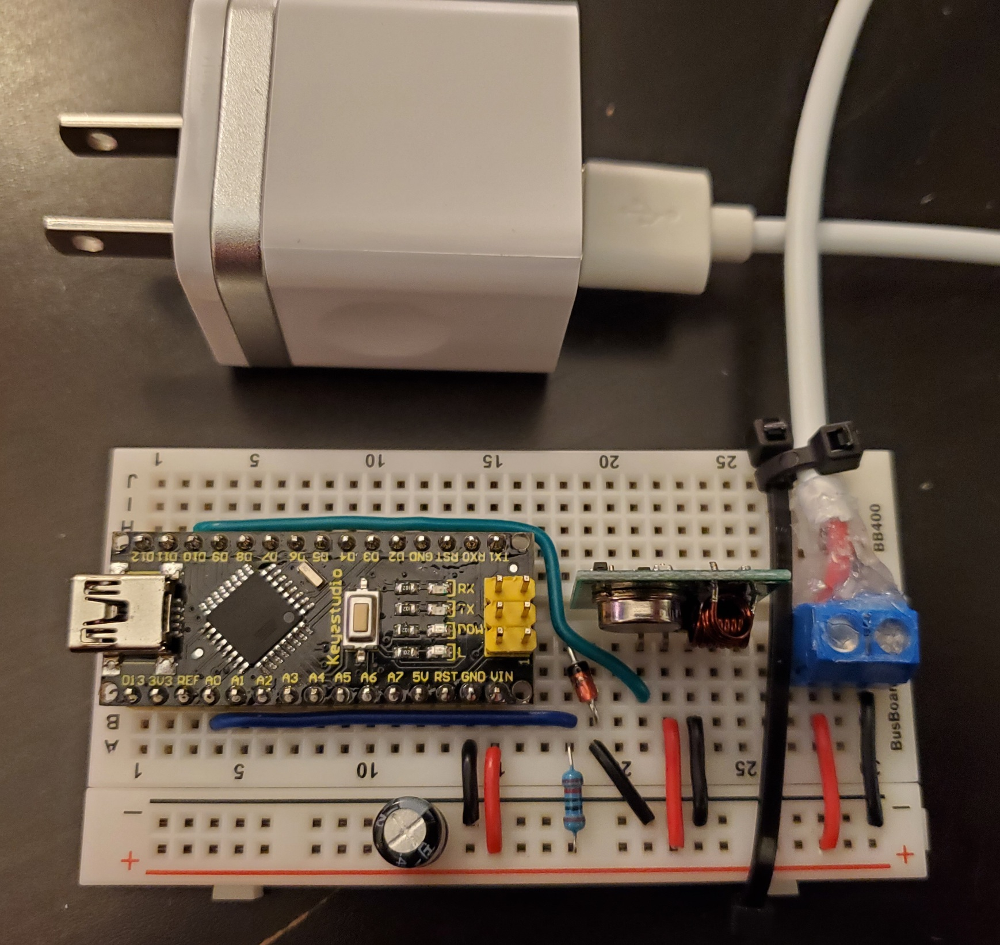

# Arduino RF Switch (MOVED)
## NOTE:
### This repo has been merged into: https://github.com/PrinceOfPuppers/smart-home-server, No further updated will happen here

> A Device Which Converts Light Switches Into RF Remotes
- [SETUP](#SETUP)
- [ABOUT](#ABOUT)

# SETUP
Create the circuit as shown in the schematic below, hooking up the `A0` pin to the zener diode cathode, and the `D10` to the `FS1000A`. Note the USB wall adapter has capacitance in addition to the 220µF capacitor shown, the capacitor used will depend on the wall adapter used, increase the capacitance if the device fails to trigger on power off, decrease it to decrease the delay from power on to rf trigger.


<br clear="left"/>
<br clear="left"/>

Once its all put togeather it should look like this:


<br clear="left"/>
<br clear="left"/>

The code depends on the arduino library `rf-switch`, it can be installed using the IDE or arduino-cli.

To flash and run the project on Linux, use:
``` 
./run.sh
```
This will also get cat serial output of the Arduino to terminal for debugging, hit ctrl-c to close it. 

# ABOUT
This device sends an RF signal when plugged in and when unplugged, before losing power. It can be plugged into switchable wall outlets and used to control RF devices, in my application its used in a larger custom `smart home system` (see: https://github.com/PrinceOfPuppers/smart-home-server)

The `ON_VALUE`, `OFF_VALUE`, `PROTOCOL` and `PULSE_LENGTH` defines will likley need to be changed to suit your application. This device can also be easily modded to preform other tasks on startup and on losing power.

Power loss is detected by using the arduinos `analogRead(PIN)` function to measure a stable reference voltage which is calibrated on startup. A reference voltage is needed as the arduino measures voltages reletive to its own. This reference voltage is supplied by a simple zener diode voltage regulator.

